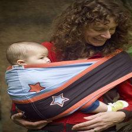
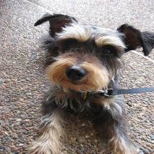
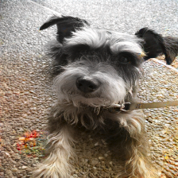

# Neural Networks Final Project: Image Colorization

## 1 Overview 
This project implements an image-colorization system using a conditional generative adversarial network (cGAN) composed of a U-Net generator and a PatchGAN discriminator. The model takes a grayscale image (the L channel of LAB color space) and predicts the missing ab color channels, learning to restore realistic color based on patterns observed in a dataset of 25,000 color images. The U-Net architecture captures both global structure and fine detail through its encoder–decoder design with skip connections, while the PatchGAN discriminator evaluates small image patches to enforce locally coherent and believable colorization. The system is trained using a combination of adversarial loss and L1 reconstruction loss, and evaluated using L1 and PSNR metrics, with utilities for visualizing outputs and testing the model on custom images.

## 2 Dataset
The [Image Colorization](https://www.kaggle.com/datasets/shravankumar9892/image-colorization) dataset contains 25,000 images at 224×224 resolution. Each image is stored in the LAB color space, where the L channel represents lightness and the ab channels capture red–green and blue–yellow color components. The dataset covers a wide range of scenes and objects.

## 3 Files
- `dataset.py`: Defines the `ColorizationDataset`, which loads, preprocesses, and optionally augments L/ab image pairs for use in training and evaluation.
- `evaluate.py`: Provides functions to compute final L1/PSNR metrics and visualize colorization results using a trained generator model.
- `main.ipynb`: Serves as the primary workflow notebook, handling data setup, model training, evaluation, and visualization.
- `models.py`: Defines the UNet generator and PatchGAN discriminator architectures.
- `train.py`: Implements the full cGAN training loop, including generator/discriminator updates, validation with L1/PSNR metrics, checkpointing, and optional saving of colorization progress images.
- `utils.py`: Contains helper functions for LAB-RGB conversion, image visualization, loss/metric plotting, and running colorization on arbitrary input images.

## 4 Setup and Execution
### 4.1 Running in Google Colab (Recommended)
1. Open `main.ipynb` in Google Colab using the link below.

    [](https://colab.research.google.com/github/laura-anker/NN-FinalProject/blob/main/main.ipynb)

2. Select a GPU runtime (Recommended: A100).
3. Clone this repository to your Colab environment and move into it by running:
    ```bash
    !git clone https://github.com/laura-anker/NN-FinalProject.git 
    %cd NN-FinalProject
    ```
4. Download the dataset into your Colab environment by running:
    ```bash
    !pip install gdown
    !gdown --folder https://drive.google.com/drive/folders/1vzL5qBJQ7AQi55g73PXc53MFCupJ3F3T?usp=drive_link -O /content/Data
    ```
5. Update the `DATA_ROOT` variable in `main.ipynb` to point to the downloaded dataset.
6. Run the notebook cells in order to preprocess the data, train the model, and view results.

### 4.2 Running Locally  
1. Download the Image Colorization dataset from the link above. 
2. Clone this repository to your machine.
3. Install the required dependencies (e.g., pip install -r requirements.txt).
4. Update the `DATA_ROOT` path in `main.ipynb` to point to your dataset folder.
5. Run the notebook cells in order to preprocess the data, train the model, and view results.

## 5 Results
The generator model reached a final validation L1 loss of 0.0899 and PSNR of 23.10 dB. Qualitative examples, like those shown below, demonstrate that it reliably captures the overall color tone and structure of a scene, producing believable skies, water, and broad object regions. However, some fine details and highly saturated areas remain muted or inconsistently colored. 


<div style="display:flex; justify-content:center; gap:20px;">
  <div style="text-align:center;">
    
    <div>True</div>
  </div>

  <div style="text-align:center;">
    
    <div>Predicted</div>
  </div>
</div>

<div style="display:flex; justify-content:center; gap:20px;">
  <div style="text-align:center;">
    
    <div>True</div>
  </div>

  <div style="text-align:center;">
    
    <div>Predicted</div>
  </div>
</div>

<div style="display:flex; justify-content:center; gap:20px;">
  <div style="text-align:center;">
    
    <div>True</div>
  </div>

  <div style="text-align:center;">
    
    <div>Predicted</div>
  </div>
</div>

## 6 Contributors
- Marlena Alvino ([@marlenaalvino](https://github.com/marlenaalvino))
- Laura Anker ([@laura-anker](https://github.com/laura-anker))
- Kealia Niles ([@kealia](https://github.com/kealia))
